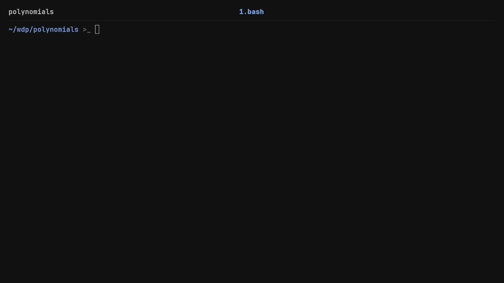

# Polynomial Calculator

A simple, neat command-line calculator for polynomials, written in C. It takes
a series of string inputs representing polynomials and performs standard
addition and multiplication operations, keeping a running track of the results
in an accumulator.

This was a straightforward project I built a while ago when I was first getting
my feet wet with C programming.



## How to Run

Clone the repository and use the provided `Makefile` to compile the project.

```bash
git clone https://github.com/ignacypekala/polynomials.git 
cd polynomials 
make
```

Run the program:

```bash
./polynomials
```

Run the test suite (with valgrind):

```bash
./test.sh
```
> Note: Running the tests with valgrind will make it much slower.

Or without valgrind:

```bash
./test.sh off
```


### Usage Example

The calculator starts with an accumulator value of `0`. You can pass a `+` to
add a polynomial or `*` to multiply. End the session with a period `.`.

**Input:**

```text
+ 2x^4 + 1
+ 4x^5 - 6x^4 - x^2 + 2
* -x + 15
.
```

## Technical Highlights

While it's a relatively simple application, it enforces some good foundational
practices:

* **Strict C Standards:** Compiled under C23 with a heavy suite of GCC flags
(`-Wall`, `-Wextra`, `-pedantic`, `-Werror`, and various sanitizers) to ensure
clean, undefined-behavior-free code.

* **Stack-Only Memory:** The program relies entirely on stack memory for
polynomial structures and pointers, intentionally avoiding dynamic allocation
(`malloc`/`free`) to keep things lightweight and leak-proof.

* **Custom Parsing:** Implements a manual string parser to read and evaluate
the mathematical expressions without relying on external regex or parsing
libraries.

* **Custom Automated Testing**: Since I wrote the parser and math logic from
scratch, I wanted to be absolutely sure they actually worked. To test it
thoroughly, I put together a custom automated setup:

    The Generator (generate_tests.py): A Python script that brute-forces valid
    polynomial inputs based on the project's grammar rules. It can spin up a
    stress-test suite of 2,000 cases (though I've only committed a small sample
    here to keep the repo clean).

    The Runner (test.sh): A Bash script that feeds the generated inputs into
    the compiled binary, compares the results against expected outputs using
    diff, and checks for memory leaks using Valgrind.

## What I Learned

Since building this, I've moved on to much more advanced programming topics,
but this project served as a great stepping stone. Specifically, it helped me:

* Grasp the foundational structure and flow of a C program.
* Get my first real hands-on experience handling and passing pointers to objects allocated on the stack.

## Acknowledgments & License

This project was originally developed for the **Wstęp do Programowania (WDP)**
(Introductory Programming) course at MIMUW (Faculty of Mathematics, Informatics
and Mechanics of the University of Warsaw).

* Course Code: [1000-211bWPI](https://usosweb.mimuw.edu.pl/kontroler.php?_action=katalog2/przedmioty/pokazPrzedmiot&prz_kod=1000-211bWPI)

The source code in this repository is my own work and is licensed under the [MIT License](./LICENSE).
